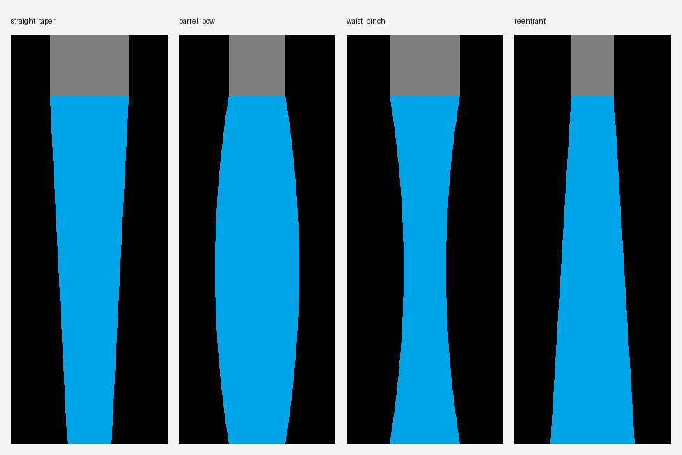

# 07 — Parametric Profiles & Curvature

Users shouldn't have to trace SEMs. Instead they **describe** the curvature with a
few numbers and the tool generates a smooth symmetric sidewall.

## Your parameter vocabulary -> geometry
| Your term      | Role in the model |
|----------------|-------------------|
| `linewidth(s)` | feature CD; also `linewidth = pitch - space` |
| `bottom_width` | full width at the base (height 0) -- control point |
| `mid_width`    | full width at mid-height -- control point |
| `top_width`    | full width at the top -- control point |
| `bow`          | mid deviation from the top/bottom average; sets sidewall curvature |
| `pitch`        | unit-cell width (one line + one space) |
| `space`        | gap width; `pitch = linewidth + space` |
| `mask_height`  | height of the mask block on top (separate material) |

Provide `pitch`, or any two of {`pitch`, `space`, `linewidth`}. Give either
`mid_width` directly or `bow` (then `mid_width = (top+bottom)/2 + bow`).

## The curvature model
A parabola is fit through the three control points
`(0, bottom/2)`, `(H/2, mid/2)`, `(H, top/2)`. Because a parabola's mid value is
its deviation from the endpoint average, **bow is literally the curvature knob**:

- `bow = 0`  -> straight taper (linear from bottom to top)
- `bow > 0`  -> barrel / bulge (widest at mid)
- `bow < 0`  -> waist / pinch (narrowest at mid)
- `bottom_width > top_width` -> re-entrant / undercut

Verified: rendered widths at bottom/mid/top match the input CDs exactly.

## Beyond three points (later)
Three control points cover taper, bow, waist, and re-entrant walls -- the common
cases. For S-shaped walls, scalloping (Bosch), or footing/notching, we extend the
same builder with either extra control points or a periodic/localized term added to
`x(height)`. Corner rounding and conformal films come in via polygon offsetting
(shapely). Mask stays a separate rectangular material on top.

## API
`incoming_profile_utility.parametric.render_line(params, out_path, nm_per_px=0.4)`
builds the symmetric polygons and writes a multi-material `.bmp` via the shared
renderer (`render_layers`).
