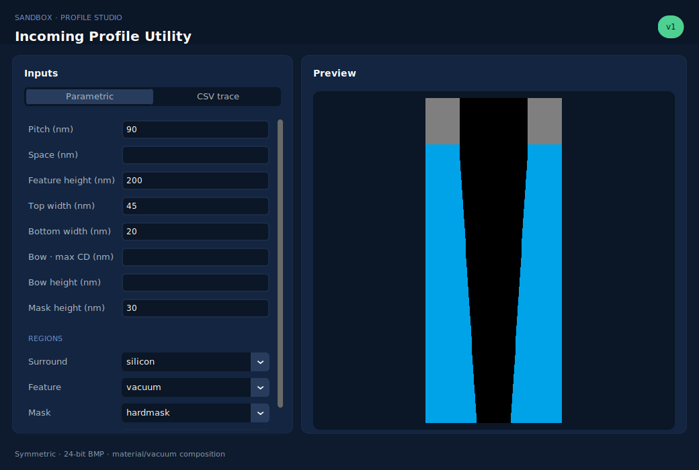

# 08 — Materials, Vacuum & the GUI

## Material palette (config/materials.json)
A *material* is a named color; `vacuum` is a first-class material (open space).
The palette is the single source of truth, loaded from `config/materials.json`, so
materials are added by editing config -- no code change. Colors are stored RGB and
converted to BGR for OpenCV at draw time (`materials.Palette`). Seeded from the four
v1 target profiles (docs/06); rename keys freely (names are optional labels).

## Regions: material OR vacuum
A profile is composed of regions, each a material or vacuum
(`parametric.build_profile`):

- `surround_material` fills the whole unit cell (default: a material)
- `feature_material`  is the CD-curve region (default: `vacuum`)
- `mask_material`     optional block/opening on top

Because either region can be a material or vacuum, any CD -- including `bow`
(max CD at a height) -- can be defined on solid material or on open space.

**Default is the inverted case:** a `vacuum` feature carved into surrounding
material (a trench/hole in material). Set `surround_material="vacuum"` and a real
material for `feature_material` to get the opposite (a solid feature in vacuum).
Layers are painted in order, so paint order == z-stack.

## GUI (customtkinter, SandBox brand)
`gui.ProfileStudio` themes the interface with the design-system tokens: navy
surfaces, one green primary action (Save .bmp), blue accents, Inter + JetBrains
Mono. It covers the v1 minimum requirements: parametric/CSV input modes, all the
dimension fields (pitch, thicknesses, curvature), material/vacuum region pickers,
scale, a live preview, and Save .bmp. Run with `profile-utility` (no args) or
`python -m incoming_profile_utility.main`.

The brand theme applies to the GUI only; rendered-profile fills use the material
palette so they stay physically meaningful.
