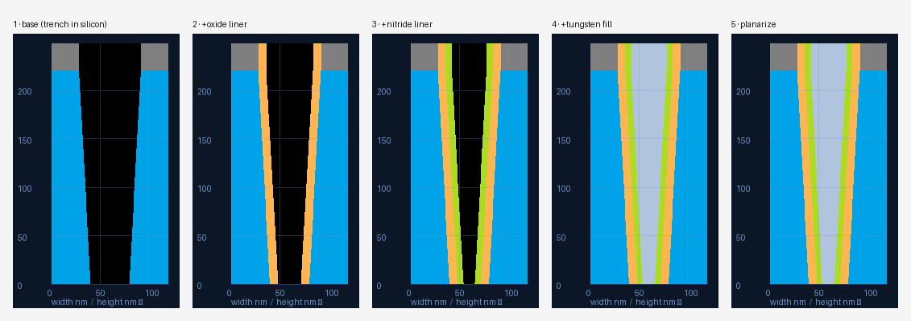
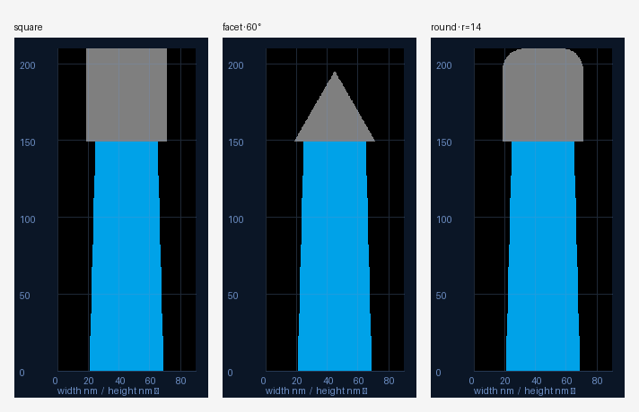

# 09 — Process-Op Engine, Layers & Mask Shapes

The multi-film profiles are built with a **2D-polygon + ordered-op** model
(`process.py`), chosen over width-at-heights because it represents the cases that
aren't separable in height: conformal shells, voids/keyholes, overhangs.

## Model
- **State** = an ordered list of `(material, 2D-polygon)` regions painted bottom→top,
  plus the derived **open** (vacuum) region = cell − solid.
- A **profile** = a base state + an ordered **op-list**. `evaluate(base, ops)` runs it.
- Rasterization (`render_regions`) paints regions in z-order and handles polygons
  **with holes**, so voids render correctly.

## Base
`build_base(params)` makes the inverted default — a vacuum trench carved into the
surround material, with a shaped mask on top. Curve params (bottom/top/mid width,
bow, bow_height) are shared with the parametric builder.

## Operations
| Op | Params | Effect |
|----|--------|--------|
| `conformal_deposit` | material, thickness | Uniform film on all exposed surfaces (offset ∩ open). |
| `planar_deposit` | material, thickness | Flat slab on top; extends the cell upward. |
| `fill` | material, up_to? | Fills the open region (trenches/voids) up to a height. |
| `etch` | depth, mode=isotropic\|anisotropic | Removes exposed material (uniform, or vertical sweep). |
| `planarize` | at_height | CMP — cut everything above a height. |

Conformality is **uniform** in v1 (structured to add top/sidewall/bottom ratios later).

Verified: a mid-height slice through a conformal stack reads
`silicon | oxide | nitride | tungsten | nitride | oxide | silicon`.

## Mask shapes (square / facet / round)
`mask_polygon(width, height, base_y, corner, facet_angle, radius)` — symmetric top
corners. **Facet** uses a sidewall angle from horizontal (fab convention; 90° == square;
lower angles taper toward a triangular top). **Round** uses a corner radius.

## Profile spec (serializable)
`render_profile_spec({"base": {...}, "ops": [ {...}, ... ]}, palette, out, nm_per_px)`
— a profile is just a base + op list, so it round-trips to JSON.

## In the GUI
Parametric mode now drives this engine directly: base fields + Surround + a
**Mask shape** control (Square / Facet / Round, facet by angle) + a live
**Process stack** of operations you can add, reorder (↑ ↓), and delete. The preview
re-renders on every change and the legend lists every material in the final stack.

